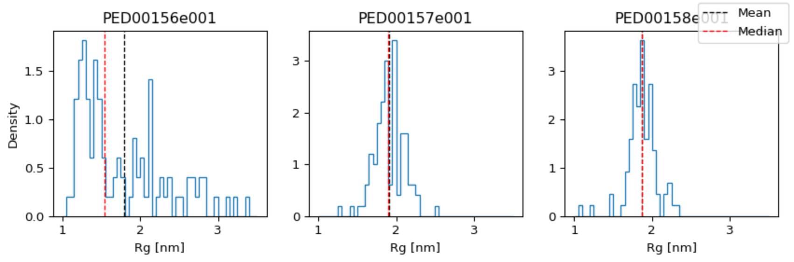
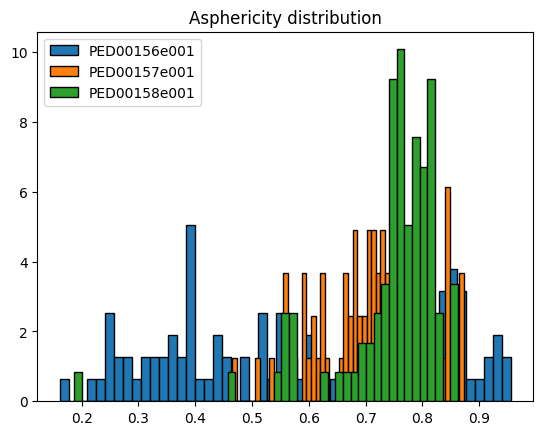
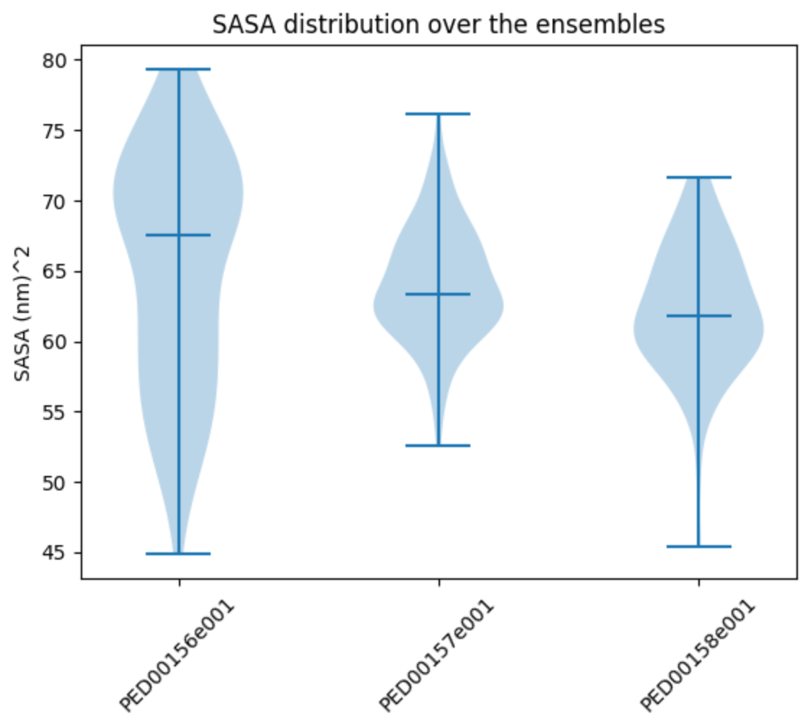

Global analysis
*******************
The global analysis of a protein is a fundamental technique for understanding its structural and dynamic properties. This approach allows the examination of various parameters, such as the radius of gyration, asphericity, and the spatial distribution of atoms, providing an overview of the protein's conformation and behavior.

In our package, we have implemented several functions for visualizing these parameters. These functions help interpret and compare results, making protein analysis easier.

To illustrate the output of our functions, we have chosen the analysis of the SH3 protein as an example. The graphs we present are related to the analysis of this protein, comparing three distinct ensembles downloaded directly from the Protein Ensemble Database (PED): PED00156, PED00157, and PED00158. These ensembles represent structural states of the N-terminal SH3 domain of the Drk protein (residues 1-59) in its unfolded form, generated with different approaches to initialize pools of random conformations.

- **PED00156**: This ensemble consists of conformations generated randomly and optimized through an iterative process.
- **PED00157**: This ensemble includes conformations generated using the ENSEMBLE method, which creates a variety of realistic conformations of an unfolded protein.
- **PED00158**: This ensemble is a combination of conformations from the RANDOM and ENSEMBLE pools, offering greater conformational diversity.

Radius of gyration
------------------
The radius of gyration of a protein is the square root of the mean square distances of the protein residues from the protein's center of mass. It is therefore a measure of the compactness of its three-dimensional structure.

*"bins": Number of bins for the histogram; default is 50.*

*"hist_range": A tuple defining the min and max values for the histogram; if None, uses the data range.*

*"multiple_hist_ax": If True, plots each histogram on a separate axis.*

*"violin_plot": If True, displays a violin plot; default is False.*

*"median": If True, shows the median; default is False.*

*"means": If True, shows the mean; default is False.*

*"dpi": The DPI (dots per inch) of the output figure; default is 96.*

*"save": If True, saves the plot as an image file; default is False.*

*"ax": The matplotlib Axes object(s) on which to plot; if None, new Axes object(s) will be created.*

.. code-block:: python

    visualization.radius_of_gyration()

.. image:: images/sh3/global_analysis/rgg.png 
   :align: center
  
.. code-block:: python

    visualization.radius_of_gyration(multiple_hist_ax=True,median=True,means=True)

End to end distance
---------------------
The end_to_end_distances function is designed to visualize the distributions of end-to-end distances in molecular structure trajectories. The end-to-end distance refers to the distance between the first and last atom in a molecular chain, a parameter often used to understand the overall conformation of a molecule.

- *"rg_norm"(bool,optional):If set to True, normalizes the end-to-end distances based on the average radius of gyration.[The default value is False]*

- *"bins"(int,optional): Defines the number of bins for the histogram of distances. More bins provide a more detailed distribution, but it may be noisier.[The default value is 50]*

- *"hist_range"(tuple, optional):A tuple specifying the minimum and maximum values for the histogram. If not specified (None), it uses the minimum and maximum values present in the data.*

- *"violin_plot"(bool,optional):If set to True, the function will generate a violin plot of the distances. [The default value is True]*

- *"means" (bool, optional):If set to True, shows the means of the distances in the violin plot. [The default value is True]*

- *"median" (bool, optional):If set to True, shows the medians of the distances in the violin plot. [The default value is True]*

- *"save" (bool, optional):If set to True, the generated plot will be saved as an image file. [The default value is False]*

- *"ax" (plt.Axes, optional):The axes on which to plot. [The default value is None]*

This example generates a violin plot of the end-to-end distances without showing the medians but including the means.

.. code-block:: python

    visualization.end_to_end_distances(median=False, means=True)

.. image:: images/sh3/global_analysis/end_to_end.png 
   :align: center

This example normalizes the end-to-end distances based on the average radius of gyration, generates a violin plot without showing the medians but including the means.

.. code-block:: python

    visualization.end_to_end_distances(rg_norm=True, violin_plot=True, median=False, means=True)

.. image:: images/sh3/global_analysis/end_to_end_norm.png 
   :align: center
  

Asphericity distribution
---------------------------
The asphericity the measure of deviation from the spherical shape of a molecule. It indicates how much a molecule differs from the ideal spherical form. A protein with an asphericity greater than zero is generally more elongated or flattened compared to a sphere.

*"bins": Number of bins for the histogram; default is 50.*

*"hist_range": A tuple defining the min and max values for the histogram; if None, uses the data range.*

*"violin_plot": If True, displays a violin plot; default is True.*

*"means": If True, shows the means in the violin plot; default is True.*

*"median": If True, shows the medians in the violin plot; default is True.*

*"save": If True, saves the plot as an image file; default is False.*

*"ax": The matplotlib Axes object on which to plot; if None, creates a new figure and axes.*

.. code-block:: python

    visualization.asphericity()

.. image:: images/sh3/global_analysis/asphericity.png
   :align: center
  
.. code-block:: python

    visualization.asphericity(violin_plot=False)

Prolatness distribution
--------------------------
 The prolateness the measure of a molecule's shape, indicating how elongated it is compared to its transverse dimensions. A protein with a prolateness greater than one is generally more elongated than a spherical shape.

*"bins": Number of bins for the histogram; default is 50.*

*"hist_range": A tuple defining the min and max values for the histogram; if None, uses the data range.*

*"violin_plot": If True, displays a violin plot; default is True.*

*"means": If True, shows the means in the violin plot; default is True.*

*"median": If True, shows the medians in the violin plot; default is True.*

*"save": If True, saves the plot as an image file; default is False.*

*"ax": The matplotlib Axes object on which to plot; if None, creates a new figure and axes.*

.. code-block:: python

    visualization.prolatness()

.. image:: images/sh3/global_analysis/prolateness.png
   :align: center
  

Radius of gyration vs Asphericity
--------------------------------------
The function *rg_vs_asphericity* also prints the Pearson correlation coefficients, which measure the strength and direction of the linear relationship between the radius of gyration (Rg) and asphericity. A Pearson coefficient value close to 1 or -1 indicates a strong positive or negative correlation, respectively, while a value close to 0 indicates a weak or no correlation.

*"save": If True, saves the plot as an image file; default is False.*

*"ax": The matplotlib Axes object on which to plot; if None, creates a new figure and axes.*

.. code-block:: python

    visualization.rg_vs_asphericity()

.. image:: images/sh3/global_analysis/rgasp.png
   :align: center
   :scale: 70%

.. image:: images/sh3/global_analysis/rg_vs_asph.png
   :align: center

Radius of gyration vs Prolatness
---------------------------------
The function *rg_vs_prolateness* also prints the Pearson correlation coefficients, which measure the strength and direction of the linear relationship between the radius of gyration (Rg) and prolateness. A Pearson coefficient value close to 1 or -1 indicates a strong positive or negative correlation, respectively, while a value close to 0 indicates a weak or no correlation.

.. code-block:: python

    visualization.rg_vs_prolatness()

.. image:: images/sh3/global_analysis/rgproll.png
   :align: center
   :scale: 70%

.. image:: images/sh3/global_analysis/rg_vs_prol.png
   :align: center
  

Global sasa distribution
---------------------------
The acronym "SASA" stands for "Solvent Accessible Surface Area" and refers to the surface area of a molecule that is accessible to the solvent. At the conformational level, "total SASA" indicates the total surface area accessible to the solvent for each conformation in the molecule's trajectory, while at the residue level, it is calculated by summing the solvent-accessible surface areas of all residues within the molecule, providing a measure of the accessibility of individual residues to the solvent. We initially analyzed this feature for each conformation and subsequently for each residue, resulting in the following graphs.

*"bins": Number of bins for the histogram; default is 50.*

*"hist_range": A tuple defining the min and max values for the histogram; if None, uses the data range.*

*"violin_plot": If True, displays a violin plot; default is True.*

*"means": If True, shows the mean; default is True.*

*"medians": If True, shows the median; default is True.*

*"save": If True, saves the plot in the data directory; default is False.*

*"ax": The matplotlib Axes object on which to plot; if None, creates a new Axes object.*

.. code-block:: python

    visualization.ensemble_sasa()

  
Alpha angles dihedral distribution
--------------------------------------
The dihedral angles represent the rotation around the bonds between consecutive alpha carbons, and their distribution reflects the spatial arrangement of amino acids in the polypeptide chain, directly influencing its three-dimensional conformation.

*"bins": Number of bins for the histogram; default is 50.*

*"save": If True, saves the plot in the data directory; default is False.*

*"ax": The matplotlib Axes object on which to plot; if None, creates a new Axes object.*

.. code-block:: python

    visualization.alpha_angles()

.. image:: images/sh3/global_analysis/dihedral.png
   :align: center
  
Relative helix content
-------------------------------
The helix content of a protein refers to the proportion or percentage of amino acids within the protein sequence that are structured into helical secondary structures. It provides insight into the amount of helical structural motifs present in the protein, which is important for understanding its overall structure, stability, and function.

*"save": If True, saves the plot in the data directory; default is False.*

*"ax": The matplotlib Axes object on which to plot; if None, creates a new Axes object.*

.. code-block:: python

    visualization.relative_helix_content()

.. image:: images/sh3/global_analysis/contentH.png
   :align: center
  
Flory scaling exponents
-------------------------
The following code block is used to calculate and print the Flory scaling exponents for different ensembles.
This code utilizes the get_features function of the EnsembleAnalysis class to extract the Flory exponents for each ensemble and then prints these values.

The Flory exponent is a parameter that describes the behavior of a polymer chain in solution, reflecting its ability to extend and occupy space in the surrounding environment. In more technical terms, it represents the relationship between the chain length and its size in three-dimensional space.

This parameter can vary from a minimum of 0.5, corresponding to a completely rigid and non-extensible chain, to a maximum of approximately 0.6-0.7, indicating a highly flexible chain capable of occupying a larger volume.

.. code-block:: python

    v_values = analysis.get_features("flory_exponent")
    for code in v_values:
    print(f"{code}: {v_values[code]:.4f}")

.. image:: images/sh3/global_analysis/flory.png
   :align: center
   :scale: 60%

Summary
----------

This code snippet calculates and displays a summary of features for each analyzed dataset. The function *get_features_summary_dataframe* is used to create a summary DataFrame that includes information about the selected key parameters. 

In the provided example, the following parameters are selected: radius of gyration (rg), end-to-end distance (end_to_end), end-to-end distance to radius of gyration ratio (ee_on_rg), and Flory exponent (flory_exponent). This DataFrame is then displayed using the display(summary) statement.

.. code-block:: python

    summary = analysis.get_features_summary_dataframe(
    selected_features=["rg", "end_to_end", "ee_on_rg", "flory_exponent"],
    show_variability=False
     )
    display(summary)

.. image:: images/sh3/global_analysis/summary.png
   :align: center
